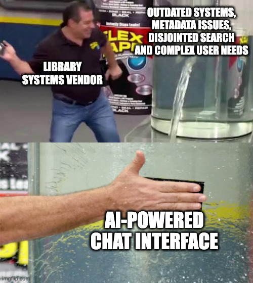

# The Case for Boring AI

## How Generative AI Hype Limits Library Imagination

Many libraries had already been exploring AI and machine learning long before ChatGPT — using [text classification](https://huggingface.co/tasks/text-classification) to organise collections, OCR to make digitised materials searchable, and [named entity recognition](https://huggingface.co/tasks/token-classification) to enrich metadata. This work was often quiet, practical, and effective.

Then [ChatGPT](https://openai.com/chatgpt) launched in late 2022 and made AI suddenly visible to everyone. For some institutions, this brought top-down pressure: directors and boards asking "how can we use this?" or "what's our AI strategy?" The natural response was understandable: "How can we chat with our collections?" Conferences filled with chatbot demos, funding proposals centred on conversational interfaces, and many institutions began treating chat as the default starting point for any AI project.

But this fixation on chat interfaces risks overshadowing the practical AI work that was already happening — and overlooks a vast landscape of applications that are often more impactful, more achievable, and better suited to the problems libraries actually face every day.

The underlying issue is that many institutions are asking the question in the wrong order. "How can we use AI?" puts the technology first — not even looking for a problem to solve, just wanting to apply the technology. The result is often just slapping a chat interface on a collection and calling it an AI project. The more productive question is: "What problems do we have, and how might AI or machine learning partly help?" Starting from real pain points — the cataloguing backlog, the unreadable scans, the sensitivity review bottleneck — leads to very different, and usually much better, answers.

## The Ferrari Problem

The ModernBERT team put it well [@modernbert2024]:

> A frontier model like OpenAI's O1 is like a Ferrari SF-23. It's an obvious triumph of engineering, designed to win races, and that's why we talk about it. But it takes a special pit crew just to change the tires and you can't buy one for yourself. In contrast, a BERT model is like a Honda Civic. It's *also* an engineering triumph, but more subtly, since *it* is engineered to be affordable, fuel-efficient, reliable, and extremely useful. And that's why they're absolutely everywhere.

This analogy applies directly to libraries. Many institutions are trying to maintain Ferraris when what they actually need are Civics. A general-purpose model that can do everything — answer questions, summarise documents, translate text, classify images — sounds appealing. But it comes with real costs: expensive compute, complex infrastructure, unpredictable outputs, and constant updates as providers change their models and pricing.

A small, task-specific model trained for one job — classifying document types, detecting languages, extracting dates — is cheaper to run, easier to validate, more predictable in production, and can often outperform the Ferrari on that specific task. It might not impress at a conference demo, but it will still be working reliably six months later.

## The Chatbot Trap

{fig-alt="Meme showing a quick fix solution" width=60%}

When asked "what should our AI project be?", libraries tend to land on the same handful of ideas: a chatbot for the catalogue, an AI research assistant, a conversational discovery tool. These can be valuable projects — but they shouldn't be the default answer, and they certainly shouldn't be the only one.

Chat interfaces are deceptively complex. Building a good conversational system means handling natural language understanding, managing dialogue state, dealing with edge cases, and running expensive compute. That's a significant investment, and it often serves a relatively small number of users.

More importantly, making chat the default starting point can mean overlooking the problems that would benefit most from AI. If your collections have incomplete metadata, unreadable scans with no OCR, or inconsistent classifications, a conversational interface won't fix those underlying issues. The most impactful AI work often happens upstream — improving the data itself — before anyone thinks about how users interact with it.

## The Power of Boring

If chat isn't the answer, what is? Often, it's the tasks that nobody would put in a conference keynote — the repetitive, unglamorous work that consumes skilled staff time every day. Or more honestly: the work that everyone agrees *should* be done but never actually gets done because there aren't enough staff or hours to get to it.

Every library has a version of this list: the cataloguing backlog that grows faster than it shrinks, the digitised collections with no OCR, the metadata that's inconsistent across decades of different cataloguing practices. These are the "we'll get around to it one day" tasks — except that day never comes.

Consider a few examples:

- **Document type classification** — distinguishing letters from reports from memos from forms. This enables faceted search and better discovery. Currently done by cataloguers manually reviewing items one by one. A small classifier can handle thousands per hour at 95% accuracy.
- **Language detection** — identifying which language an uncatalogued item is in, so it can be routed to the right specialist. Currently done by generalist staff scanning text. An off-the-shelf model achieves 99% accuracy instantly.
- **Quality assessment** — checking whether a digitised scan is legible, properly cropped, and correctly oriented. Currently done through spot checks on a fraction of items. A model can apply consistent standards across an entire collection.
- **Sensitivity screening** — flagging pages that may contain personal information before a collection is made public. Currently done through page-by-page human review. Automated flagging doesn't replace human judgement, but it dramatically reduces what needs to be reviewed.

None of these tasks are exciting. All of them transform how a library operates. And crucially, the results feed directly into existing infrastructure — better metadata means better search through the systems you already have, without needing to rebuild anything from scratch.

## Task-Specific Models: The Unsung Heroes

The models that do this boring work aren't the ones making headlines. They're small, specialised, and often free to use.

**OCR models** have improved dramatically in recent years. Modern vision-language models can read historical typefaces, handle handwriting from different eras, preserve complex page layouts, and extract text from tables and marginalia — tasks that older OCR engines like [Tesseract](https://github.com/tesseract-ocr/tesseract) struggled with. Many of these models are small enough to run on a single GPU, or even as a cloud job costing fractions of a penny per page.

**Classification models** can learn a library's own taxonomies and institutional preferences. A model fine-tuned on your cataloguing decisions can apply those same decisions to thousands of items on modest hardware. These don't need to be large — a model small enough to run in a web browser can still classify documents with high accuracy.

**Extraction models** pull structured information from unstructured text: named entities like dates, people, and places; bibliographic references; structured data from forms and catalogue cards. These turn pages of text into searchable, linkable metadata.

What these models share is that they do one thing well, they do it cheaply, and their outputs are predictable enough to validate and trust.

It's also worth noting that the line between "task-specific model" and "general-purpose model" is blurring. *Small* language models and vision-language models — in the 1-8 billion parameter range — can now handle many of these tasks well, especially with the right prompting or light fine-tuning. For the [National Library of Scotland's](https://www.nls.uk/) index card extraction work, we ended up using a small vision-language model rather than building separate OCR and extraction pipelines. The key distinction isn't really about model architecture — it's about using the right-sized tool for the job, rather than defaulting to the largest model available.

## A Blast from the Past

For many, language models and vision-language models are their first exposure to AI but modern models are the product of foundational work that [started in the 1940s](https://www.ibm.com/think/topics/history-of-artificial-intelligence). The *really* boring truth is that the best model for the job may be older than the computer itself.

On the right classification task, logistic-regression ([first developed in the 1830s and 1840s](https://en.wikipedia.org/wiki/Logistic_regression#History)) can outperform even the largest language models of today while being near instant to train and run, all while using small amounts of data. It is always a good idea to start with the smallest, cheapest approach and scale up only if necessary. Packages like [scikit-learn](https://scikit-learn.org/stable/) and [SciPy](https://scipy.org/) will cover nearly every classical AI approach you could feasibly need (and more).

Logistic regression, among many other traditional AI approaches, is always good to set a strong baseline which you can reference to know whether more complex or expensive approaches are worth their keep.

## Sustainable AI for Libraries

Beyond being more useful, boring AI is also more sustainable. The advantages compound over time.

The barriers to entry are lower. Traditional models like classifiers and language detectors have been around for years — well-understood, well-documented, and battle-tested. And even when you use newer small language models or vision-language models, you're still using them to do one narrow, boring, useful task — not asking them to do everything. The underlying technology may be newer, but the *task* is still predictable, which is exactly what you want.

The outcomes are predictable. When a model classifies documents or detects languages, you can measure its accuracy, validate its outputs against known examples, and know what to expect in production. There are no surprises where the model suddenly generates plausible-sounding nonsense — a real risk with larger generative models given free rein.

And the impact scales. A classification model trained for one department can be adapted for another. A pipeline built for one collection can be reused on the next. The knowledge stays within the institution rather than depending on an external provider's API that might change its pricing or capabilities without notice.

## Reframing Success

If boring AI requires a different approach, it also requires different measures of success. The question isn't "is this technically impressive?" but "did it make a difference?"

Useful metrics include: staff hours reclaimed for higher-value work, materials made discoverable that were previously invisible, metadata consistency across a collection, processing speed for backlogs, and the size of the backlog itself. These aren't glamorous numbers, but they're the ones that matter to library directors, funders, and — most importantly — users who can now find things they couldn't before.

## The Path Forward

Getting started doesn't require a large budget or a data science team. A practical starting point:

1. **Identify repetitive tasks** — walk through your workflows and look for the places where skilled staff spend time on repetitive decisions. These are your candidates.
2. **Look for clear decisions** — the best tasks for AI have well-defined inputs and outputs. "Is this a letter or a report?" is a better starting point than "what is this document about?"
3. **Accept good enough** — an 80% accurate classifier that processes your entire backlog is more useful than a 99% accurate process that only gets applied to 5% of items because it requires manual review. Imperfection at scale beats perfection on a handful.
4. **Start small** — pick one collection, one task, one model. Prove it works before expanding.
5. **Build expertise** — each project builds institutional knowledge. The second project is always easier than the first.
6. **Share solutions** — a pipeline built for your collection can often be reused by other institutions facing the same problem. Open tools and open models benefit everyone.

