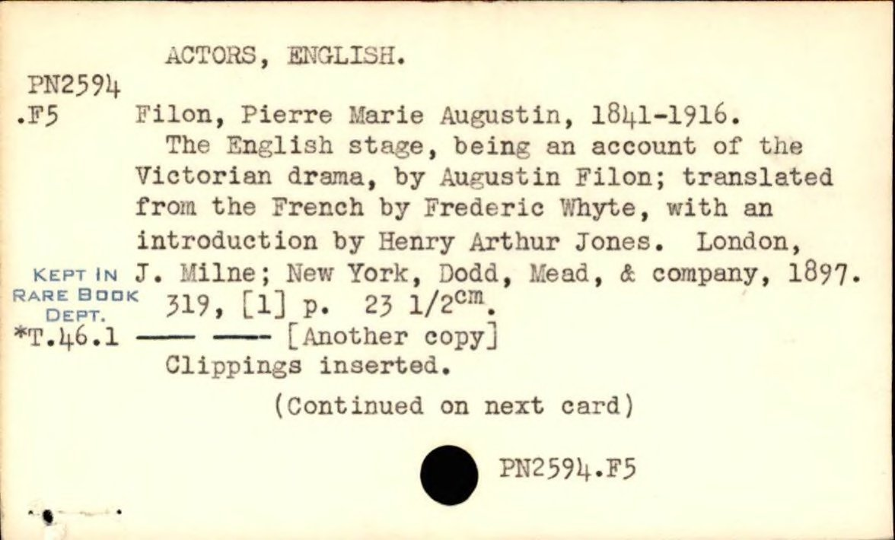
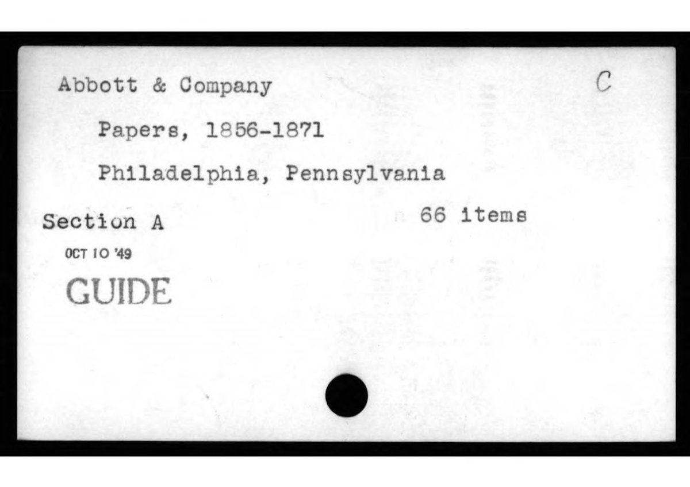
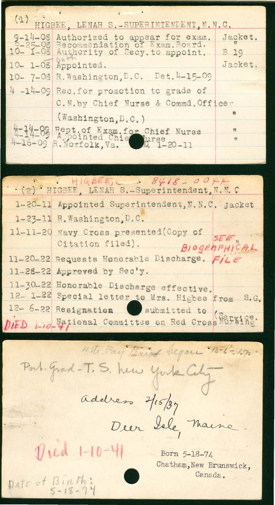
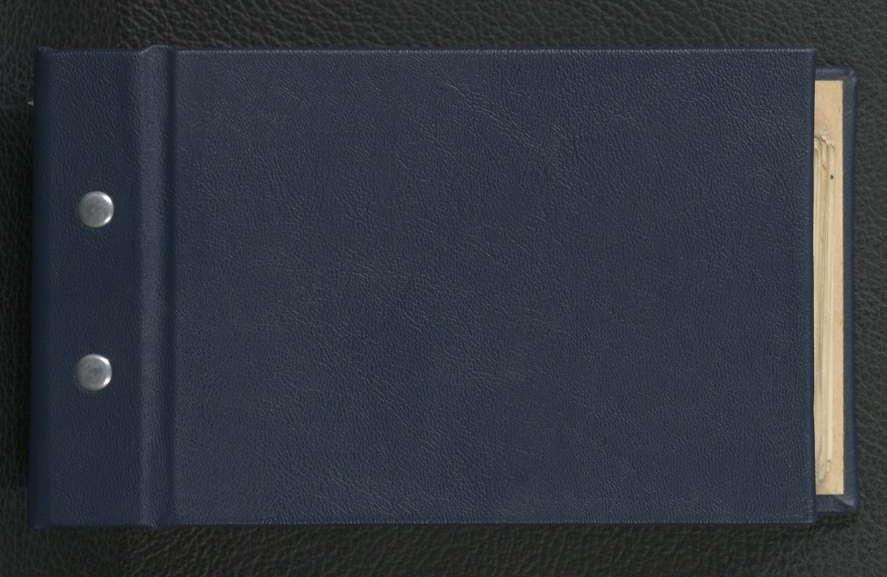

# Extending a Community Model

The detector built in [Agentic Data and Model Development](agentic-workflows.qmd) worked on one institution's pages — National Library of Scotland Advocates Library cards, photographed at one resolution, in one style. That model is published on the Hub, and other GLAM teams will eventually look at it for *their* card collections: [Boston Public Library printed catalogues](https://huggingface.co/datasets/biglam/bpl-card-catalog), [Duke Rubenstein manuscript cards](https://huggingface.co/datasets/biglam/rubenstein-manuscript-catalog), [US Navy Nurse Corps biographical record sheets](https://huggingface.co/datasets/biglam/index-cards-navy-nurse-corps) with multiple cards laid out together, and so on.

The natural question is: do they re-train from scratch, fine-tune, or contribute back? The pattern in this chapter is the third option, done cheaply.


## The Setup

Four other archival card collections were available on the Hub, all with different shapes:

- **Pre-cropped single-card images** ([BPL](https://huggingface.co/datasets/biglam/bpl-card-catalog), [Rubenstein](https://huggingface.co/datasets/biglam/rubenstein-manuscript-catalog)) — each scan is already one card, filling the frame
- **Multi-card sheets** ([US Navy Nurse Corps](https://huggingface.co/datasets/biglam/index-cards-navy-nurse-corps)) — 2–9 cards laid out together on a dark backing, photographed as one image
- **Book pages, not cards** ([Sloane catalogues](https://huggingface.co/datasets/biglam/sloane-catalogues)) — same Hub collection, wrong task

The starting hypothesis was that the NLS v1 detector would work on some of these and fail on others. The actual goal: extend v1 to cover all four shapes without losing what already worked on NLS pages.

::: {layout-ncol=2}



:::

::: {layout-ncol=2}



:::

## The Recipe

Six steps, in order. None individually complicated; together they get from v1 to a meaningfully better v5 in a few hours of agent-driven work plus a couple of focused review passes.

1. **Validate the existing model on each new collection first** (call it Gate A). Don't assume it fails — for some collections it will already work well enough. For others the failure mode tells you what's actually missing from training. On a small random sample per collection, run v1 and look at the boxes. The point is not metrics; it's eyeballs.
2. **For pre-cropped sources, use structural labels.** When the source dataset is "one card per image, the card fills the frame," the bounding box is `[1, 1, W-2, H-2]`. No annotation needed. This produced 1,300 training rows for free across BPL and Rubenstein.
3. **For genuinely new data shapes, bootstrap with a foundation model and review.** Navy's multi-card sheets needed real boxes. SAM3 with `--class-name "card"` at a low confidence threshold produced strong candidates; a small custom HTML editor (Claude Code built it in a session — same pattern as the v1 chapter) lets a domain expert correct in one pass.
4. **Keep base-distribution samples in the training mix.** This is the move that prevents catastrophic forgetting. The v3 training set included the 100 original NLS pages alongside the new collections. Per-collection validation later confirmed NLS performance was preserved.
5. **Use a model ensemble to find the labels worth reviewing again.** Once you have a working v_n, train v_n+1 with a different hyperparameter choice (a `multi_scale=True` variant, say). Predict with *both* on a small, high-value subset. Greedy IoU-NMS fuses the predictions; the surviving boxes carry provenance — *both models found this*, or *only v_n*, or *only v_n+1*. Sort the review queue by disagreement count. For 25 navy images and 86 fused boxes, only **3 boxes** needed real attention — the rest were unanimous and trustworthy.
6. **Ship with sibling checkpoints documented.** The hyperparameter variant that *didn't* win is still useful — as a comparison point and as a teachable artefact. The Hub model-card `new_version` metadata field makes it explicit which checkpoint supersedes which.

## What Surprised Us

Two things were not in the original plan.

**Multi-scale augmentation regressed on the hard cases.** A common YOLO recipe is to train with `multi_scale=True` so the model sees inputs at varied resolutions. On a 3×3 grid of nine multi-card scans — the canary regression test — the multi-scale variant found 7 of 9 at default confidence vs the single-scale variant's 9/9. The accepted-wisdom move actively hurt the hardest in-distribution case. Worth flagging: "more augmentation = more robust" doesn't always hold for object detection on constrained datasets.

**Ensemble re-labelling is a different annotation regime.** The intuitive default — *take my new model's predictions, review them all, push back into training* — works but scales poorly with collection size. With two model versions and IoU-NMS, you can identify and review *only the disagreements*. Out of 86 ensemble boxes across 25 images, 83 were unanimous (= trustworthy without re-review) and 3 were disagreements (= the only places real human attention was needed). It made the second labelling round take minutes, not hours.

## Show the Seams

The original prompt was about as rough as it gets:

```
https://huggingface.co/datasets/biglam/index-cards-navy-nurse-corps

I wonder if we could adapt this existing detector + try uv-scripts/sam3 or
uv-scripts/vlm-object-detection to work with this new dataset?

it has some images which contain multiple index cards
goal would be to train a new model that could handle more variety
```

A few decisions emerged mid-conversation that were not in the prompt:

- *"skip sloane is very different"* — recognising mid-exploration that book pages aren't index cards and shouldn't be in training at all
- *"the challenging part ood will be the multiple cards"* — naming the actual hard subset; the cropped collections are trivial labels
- *"we should then train quite early and then correct model output is but push back if this is not best approach"* — explicit licence to iterate over polishing labels
- *"maybe worth one more round of labelling using signal from a mix of models we have"* — the prompt that produced the ensemble pattern

These are the load-bearing moments. The rest of the conversation was scaffolding the agent could handle on its own.

## The Result

| Collection | NLS v1 (baseline) | v3 (extended) | v5 (final) |
|---|---|---|---|
| NLS Advocates pages | strong | 0.980 | 0.977 |
| Navy multi-card sheets | misses all | 0.929 | **0.983** |
| BPL pre-cropped cards | unreliable | 0.995 | 0.995 |
| Rubenstein handwritten | unreliable | 0.995 | 0.995 |
| 9-card grid canary | 0 / 9 | 9 / 9 | **9 / 9 @ conf 0.98** |

mAP@50:95 on held-out per-collection validation. The final checkpoint is published at [`small-models-for-glam/index-card-detector-v5`](https://huggingface.co/small-models-for-glam/index-card-detector-v5) with an ONNX export and a [demo Space](https://huggingface.co/spaces/small-models-for-glam/archival-index-card-detector). The training data lives at [`small-models-for-glam/index-card-detection-v5`](https://huggingface.co/datasets/small-models-for-glam/index-card-detection-v5).

## The Broader Pattern

The recipe generalises beyond card detection. Whenever there's a published model that *mostly* works for your collection — a layout detector, a region segmenter, a metadata extractor — the same six-step move applies. Validate, label cheaply where you can, bootstrap where you must, keep the base distribution in your training mix, ensemble to find the labels worth re-reviewing, ship the failed variant honestly alongside the winner.

For agentic-builder readers: the pattern is "extend an existing artefact" rather than "build a new one." It scales differently. The cost of the second iteration drops sharply because so much of the scaffolding — the editor, the prediction pipeline, the eval script — is already written.

::: {.callout-tip collapse="true"}
## Try it yourself: extend a Hub detector for your own collection

Paste this into an agent (e.g. Claude Code), filling in the bracketed lines.

```text
I want to extend an existing Hugging Face object detector to handle my own
archival collection without regressing on the original distribution.

The base model: [a Hub model id, e.g. NationalLibraryOfScotland/archival-index-card-detector]
My new collection(s): [Hub dataset id(s), OR local folder/zip]
My target objects: [e.g. "index cards", "illustrations", "table regions"]

Please work iteratively and check with me before anything public:

1. Gate A — pull a small random sample from each new collection and run the
   base model on it. Show me the predictions. We decide together whether the
   model already works, or where it fails, BEFORE labelling anything.

2. For pre-cropped or trivially-labellable sources, use structural labels
   (bbox = whole image, etc.) instead of annotation.

3. For genuinely new shapes, bootstrap with SAM3 (uv-scripts/sam3) at low
   confidence, then build me a small HTML bbox editor so I can correct in one
   pass. Apply obvious heuristics (NMS, area/aspect filters) before review to
   pre-clean.

4. When training, INCLUDE samples from the base model's original training
   distribution so we don't catastrophically forget it. Verify per-collection
   mAP on a held-out set.

5. After v_n trains, train v_n+1 with one hyperparameter variation (e.g.
   multi_scale, or different augmentation). Predict with both on a small
   sample, fuse via IoU-NMS, and surface ONLY the disagreements for me to
   review. Most boxes will be unanimous and trustworthy.

6. Ship the winner publicly with a model card; ship the losing variant too
   (with new_version metadata pointing at the winner) so the comparison is
   documented honestly.

Push the model + dataset to my org with a Space demo and a known regression
test image (the hardest case I have) before flipping anything public.
```

If it works on your collection, consider contributing it to [`small-models-for-glam`](https://huggingface.co/small-models-for-glam) — the more institutions that contribute, the better the shared pile becomes.
:::
