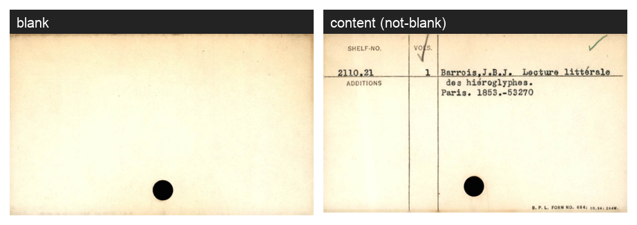

# A Tiny Pre-Filter: Skipping Blank Cards Before the Expensive Step

The [previous chapter](agentic-workflows.qmd) described training an object detector to find index cards in scanned pages. But finding a card is only the first step. Before sending each card to a Vision Language Model for metadata extraction — the slow, expensive part of the pipeline — it is worth asking a cheaper question: *is there anything on this card worth reading?*

Card catalogues are full of **blank cards** — bare stock, often with nothing but a punch-hole. Running a 4-billion-parameter model on them wastes compute and litters the output with empty records. The useful question is binary and visually easy: **is this card blank, or is there something on it?** A dedicated, tiny classifier that answers *blank vs not-blank* — in milliseconds on an ordinary CPU — removes that waste. It is a *pre-filter*: a cheap gate in front of an expensive process. (Its two labels are `blank` and `content`, where *content* simply means "anything written on" — a typed catalogue card or a printed divider alike — so dividers land on the not-blank side and still reach the VLM, which is exactly what you want.)



This chapter is a companion case study to the previous one. It uses the same agentic loop, but applied to **classification**, and it leans even harder on a theme that runs through this book: most of the work is getting the data right, and an AI agent can do almost all of it.

## When This Works

A tiny pre-filter is worth building when:

- **A cheap signal can stand in for an expensive judgement.** You don't need a 4B-parameter model to tell a blank card from a typed one — the distinction is visually obvious. Pushing that decision to a sub-1-million-parameter model that runs on a laptop frees the expensive model for the cards that actually need it.
- **You are processing at scale.** Filtering out even 30–40% of cards before the costly step compounds across hundreds of thousands of images.
- **The classes are easy to recognise but tedious to label by hand.** This is the sweet spot for weak supervision: cheap, imperfect signals can be combined into training labels, with a human only checking the ambiguous cases.

## What You Need

- **A representative sample of cards** from your collection (a few hundred is enough to start).
- **Some weak signals.** Anything that *correlates* with the label, even imperfectly: an existing detector, a metadata field from an earlier processing step, or a simple image heuristic.
- **An AI coding assistant and modest compute.** The model here trained on a Hugging Face Jobs GPU costing a few cents; it would also train on a laptop.

## Case Study: A Blank-Card Filter for Two Libraries

The goal was a classifier that generalises across collections, so it was built on two very different card styles at once: **Boston Public Library (BPL)** shelf-list cards (a printed form with typed entries) and **National Library of Scotland (NLS)** Advocates Library cards (typed text on plain stock). The entire workflow below was run by an AI agent (Claude Code) in a single working session, with a human reviewing results at each gate. The overall shape:

```{mermaid}
flowchart TD
  A["Card images<br/>(BPL + NLS)"] --> B["Weak signals:<br/>card-detector · metadata field · ink-density"]
  B --> C{"Signals agree?"}
  C -- "yes" --> D["Auto-accept label"]
  C -- "no" --> E["Human review<br/>(correct / wrong UI)"]
  D --> F["Dataset +<br/>human-verified gold set"]
  E --> F
  F --> G["Train tiny model<br/>on Hugging Face Jobs"]
  G --> H["Evaluate per collection<br/>+ unseen-card check"]
  H --> Q{"Good enough?"}
  Q -- "no: gaps or errors" --> R["Harvest more cards<br/>/ fix labels"]
  R --> F
  Q -- "yes" --> I{"Ship: CPU pre-filter<br/>0.95M params"}
  I -- "blank" --> J["Skip"]
  I -- "not blank" --> K["Vision-Language Model<br/>(metadata extraction)"]
```

**No cards were labelled by hand from scratch.** Instead, labels were *bootstrapped* by combining weak signals, with the agent verifying samples by eye:

1. **Validate a borrowing signal before trusting it.** The card *detector* from the previous chapter can double as a blank detector: run it on a single cropped card, and if it finds no card, the card is probably blank. But that detector had never seen these cropped, single-card images. Testing it first was essential — and revealing: it separated blank from content **perfectly on NLS cards, but unreliably on BPL cards** (it falsely "found" a card on a third of the blanks). So it was kept as a trusted signal for NLS and demoted to a secondary vote for BPL. *Always check that a borrowed model behaves on your data before believing it.*
2. **Find a signal that works everywhere.** A simple **ink-density** heuristic — what fraction of the card is dark, after digitally removing the punch-hole — cleanly separates bare stock from a printed form. Calibrated against a small set of known cards, it caught 100% of blanks. This became the workhorse signal, and because it is so cheap, it was used to **harvest** hundreds of additional blank cards from unlabelled drawers.
3. **Fuse the signals; route disagreements to a human.** Where the signals agreed, the label was accepted automatically. Where they disagreed, the card was set aside for review. The agent then verified the held-out test set image by image.
4. **Train a tiny model and check the size/speed trade-off.** Three small backbones were trained on Hugging Face Jobs and compared. All three reached the accuracy ceiling, so the smallest won.

| Backbone | Parameters | Gold accuracy | CPU latency (per card) |
|---|---|---|---|
| **MobileViT-XX-Small** (chosen) | **0.95M** | 100% | ~26 ms |
| MobileNetV2 | 2.23M | 100% | ~37 ms |
| ViT-Tiny | 5.52M | 100% | ~17 ms |

The chosen model is under one million parameters and classifies a card in milliseconds on a CPU — the published model and dataset live on the [`small-models-for-glam`](https://huggingface.co/small-models-for-glam) organisation.

::: {.callout-warning}
## Evaluate the way you deploy
A subtle bug nearly slipped through. Measured inside the training job, the model scored a perfect 100%. But when evaluated through the *actual inference path* used in production, three blank cards were misread as content. The cause: the images were prepared slightly differently during training than during inference. The lesson — true throughout this book — is that an evaluation number is only trustworthy if it is produced the same way the model will actually be used.
:::

## Does it hold up on unseen cards?

A pre-filter is only useful if it survives cards it never trained on, so it was checked three ways — every prediction below was then verified by eye:

- **Held-out cards from the trained collections** — 100%, and crucially, blank cards carrying a punch-hole or a faint show-through smudge were still read as `blank`, not `content`.
- **Three *different* BPL card styles the model wasn't trained on** — shelf-list forms, typed rare-books cards, and manuscript cards — **98 of 98 correct**.
- **A different institution entirely** — Duke University's Rubenstein Library manuscript catalogue — **48 of 48**, including *handwritten* cards, a style the model had never seen.


The blank concept transferred across collections because they share the same physical tell (bare cream stock plus a punch-hole), and the content side held up even on handwriting. The one case still untested is a blank card from a library whose stock looks nothing like this — exactly the gap the "just append rows" dataset design exists to close.

An honest limitation worth stating: the NLS collection had plenty of *content* cards but no clean blank *fronts* to learn from (its empty examples were blank *pages*, a different thing). So this first version filters blanks reliably for BPL and recognises NLS *content*, with NLS blank-detection deferred until suitable examples are gathered. The dataset is built so that adding a new collection is just appending rows — which is the whole point.

## What working with the agent looked like

The human in this loop never wrote a training script or touched the model code. They steered with plain-language instructions and reviewed what came back. The brief that kicked it off looked roughly like this — note that it is about *goals and judgement*, not code:

```text
Build a small image classifier that labels an archival index card "blank" or
"not blank". I want it as a cheap pre-filter to run BEFORE an expensive
vision-language model, so we skip empty cards instead of paying to read them.

Work data-first — don't train anything until we're confident the labels are right:
- Start from cards already on the Hub:
    davanstrien/bpl-shelf-list-nuextract3   (BPL cards + a VLM "card_type" field)
    NationalLibraryOfScotland/nls-index-cards-object-detection  (NLS cards + boxes)
- Bootstrap the labels from weak signals — the existing card detector
    NationalLibraryOfScotland/archival-index-card-detector
  the card_type field above, and a simple ink-density heuristic — and only
  AUTO-ACCEPT a label when the signals agree. Show me the disagreements.
- Validate any borrowed signal on our cards before trusting it.
- Hold out a small test set and let me eyeball it before we believe any numbers.

Then train the smallest model that clears the bar, on Hugging Face Jobs, and
report accuracy per collection. Check with me before anything irreversible.
```

Everything that prompt points at is open: the input cards
([BPL](https://huggingface.co/datasets/davanstrien/bpl-shelf-list-nuextract3),
[NLS](https://huggingface.co/datasets/NationalLibraryOfScotland/nls-index-cards-object-detection)),
the borrowed [card detector](https://huggingface.co/NationalLibraryOfScotland/archival-index-card-detector),
and the resulting [model](https://huggingface.co/small-models-for-glam/index-card-blank-detector)
and [dataset](https://huggingface.co/datasets/small-models-for-glam/index-card-blank-content) —
so the whole thing is reproducible end to end.

The follow-ups were short course-corrections as the work progressed:

- *"Show me some examples so I can validate the outputs."* The agent generated labelled contact-sheets of cards per class, which the human skimmed to confirm the labels looked right.
- *"Generate some out-of-distribution cards for me to review, with a simple correct/wrong interface."* The agent built a small self-contained web page — each card shown with the model's guess and a **Correct / Wrong** button — that the human clicked through, exporting the verdicts as a file. (That is where the 98/98 and 48/48 numbers above came from.)
- *"Run that on Jobs — the I/O throughput will be much better."* The agent had been streaming a dataset down to the laptop; the human redirected it to run inside Hugging Face's datacentre instead, and it went from stuck to done in minutes.
- *"I'm happy with two classes — that's enough signal to be useful."* A scope decision that closed off a whole branch of further work (a third "divider" class) the agent had been ready to pursue.

The texture is **steer → review → correct** — much closer to editing and quality control than to programming. The agent did the building (download pipelines, the weak-signal fusion, the training jobs on Hugging Face, the throwaway review UIs) and, crucially, the *checking of its own work*. At one point it caught a bug in **its own evaluation** — the deployment-path mismatch described above — precisely because it had been told to test the model the way it would actually be used, not just trust the training score.

The human's job was the part a domain expert is best placed to do: set the goal, look at the cards at each gate, and make the judgement calls — *is this card actually blank? is this label right? is two classes enough?* You do not need to become a machine-learning engineer to get a model like this. You need to know your collection well enough to recognise a good answer, and to give clear instructions and honest feedback at each step.

## The General Pattern

The reusable shape here is **weak signals + agent tooling + human verification → a tiny, deployable model**:

- **Bootstrap labels from signals you already have.** A previous model's output, an existing metadata field, a simple heuristic. None has to be perfect; combining them and dropping the disagreements yields clean labels cheaply.
- **Spend human time only at the boundary.** Verify the ambiguous cases and the test set; let the agent handle the bulk.
- **Train small and deploy cheap.** For an easy, high-volume task, a tiny model that runs on a CPU beats a large one that needs a GPU.

This is the same loop as the object-detector chapter, and it generalises to any institution with a card catalogue — or, more broadly, any large collection where a cheap filter can protect an expensive process.

It is also the same move that frontier dataset curation makes at web scale. In [WebOrganizer](https://huggingface.co/papers/2502.10341), the judgements of a 405-billion-parameter model are distilled into **140-million-parameter** classifiers so an entire web corpus can be sorted into domains cheaply enough to run over hundreds of billions of tokens. Same shape, four orders of magnitude apart: a big model (or, here, a handful of weak signals) teaches a small one, and the small one does the work at scale. For a library it is the difference between a filter you can actually run over millions of cards on a CPU and one you cannot afford to.

::: {.callout-tip}
## Use this for your own collection
Point an agent at a sample of your card images. Ask it to bootstrap labels from whatever weak signals you have — a detector, an existing metadata field, an ink-density heuristic — to auto-accept where they agree and surface the disagreements for you to check. Hold out a small set you verify by hand, train a tiny classifier, and tag your cards with a collection name so the dataset can grow. The [recipe and scripts](https://huggingface.co/small-models-for-glam) are reusable as-is.
:::

## A library of small models, built together

This model and its dataset live in [`small-models-for-glam`](https://huggingface.co/small-models-for-glam) — a shared home for exactly this kind of small, task-specific model (and the data behind it) for galleries, libraries, archives, and museums. The point is not one clever classifier. It is that agents make models like this so cheap to build that a *community* can produce **many** of them — a blank-card filter here, an illustration detector there, a name parser, a layout classifier — each tiny, CPU-runnable, openly licensed, and documented so the next institution can reuse or extend it instead of starting over.

That adds up to something bigger than any single model: a growing ecosystem of small, specialised, openly-shared tools that let GLAM institutions process their collections cheaply and on their own terms — rather than depending solely on a handful of large, expensive, closed models. The big models are extraordinary teachers; here one helped bootstrap the labels. But the durable result is a small model an institution fully owns and can run on a laptop. If you build one for your collection, add it to the pile — and bring your data and your judgement, because that is the part no foundation model can supply.

::: {.callout-tip collapse="true"}
## Try it yourself: a ready-to-go prompt for your own collection

Paste this into an agent (e.g. Claude Code), filling in the one bracketed line. It encodes the good habits from this chapter — data-first, validate borrowed signals, auto-accept only on agreement, a human-verified test set, the smallest model, and evaluating the way you deploy.

**Setup & compute.** Install the Hugging Face CLI first ([installation guide](https://huggingface.co/docs/huggingface_hub/installation)). Models this small train fine on a modest local GPU — or even on CPU, just more slowly — so check what you have. If you'd rather not set up a local GPU at all, run the training step on [Hugging Face Jobs](https://huggingface.co/docs/hub/jobs-overview): cloud GPUs (or CPUs), pay-as-you-go, no local setup. The prompt below uses Jobs by default.

```text
I want to build a tiny "blank vs not-blank" image classifier for my own card
catalogue, to use as a cheap pre-filter before an expensive vision-language model.

My cards: [a Hugging Face dataset id, OR a local folder / zip of card images].

Please work data-first — don't train until we're confident the labels are right:
1. Bootstrap labels from whatever weak signals my cards have — e.g. an existing
   card/region detector, any OCR text or metadata field (empty text ~= blank),
   and a simple ink-density heuristic (ignore the punch-hole if there is one).
   AUTO-ACCEPT a label only when the signals agree; set disagreements aside.
2. Validate any borrowed model/heuristic on MY cards before trusting it — show me
   ~30 known-blank and ~30 known-content examples and how each signal did.
3. Build me a quick correct/wrong review page so I can eyeball samples, and hold
   out a small test set that I verify by hand.
4. Train the smallest transformers image classifier that clears ~95% (start with
   apple/mobilevit-xx-small). Run training on Hugging Face Jobs so I don't need a
   local GPU — or train locally if I have a GPU, or on CPU if I'm OK with slower.
   Report accuracy per source collection.
5. Evaluate through the real inference path (pipeline / ONNX), not just the
   training score, and show me the mistakes.
6. Push the model + dataset (with provenance) to my org, tagging rows with a
   collection name so I can add more collections later.

Check with me before anything public or irreversible.
```

If it works, consider contributing the model and dataset to [`small-models-for-glam`](https://huggingface.co/small-models-for-glam) so the next institution can build on yours.
:::
